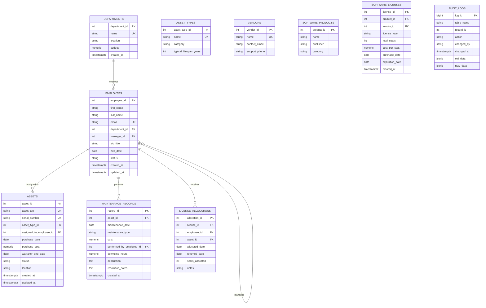

# IT Asset Management Database (ITAM DB)
## CS103: Databases Portfolio Project

**Author:** Randall James  
**Date:** June 2026  
**Purpose:** Portfolio project demonstrating end-to-end database design, implementation, optimization, and analytical querying skills in PostgreSQL. Built specifically to showcase SQL proficiency for IT Data Analyst / Data Coordinator / Project Coordinator roles.

---

## Project Overview

This project implements a fully normalized, production-style **IT Asset Management (ITAM)** database for a fictional mid-sized technology company **"Aether Dynamics"** (150+ employees across multiple departments).

The database models the complete lifecycle of IT assets:
- Hardware procurement, assignment, and retirement
- Software licensing and compliance tracking
- Maintenance and repair history
- Employee and departmental ownership
- Audit logging for governance and compliance

### Why This Domain?
IT Asset Management is highly relevant to **IT Data Analyst** positions because it requires:
- Complex multi-table joins and aggregations
- Time-series and trend analysis (warranty expiration, utilization over time)
- Compliance reporting (license audits, SOX/GLP-adjacent controls)
- Cost allocation and depreciation insights
- Data quality enforcement through constraints and triggers
- Performance optimization for reporting dashboards

---

## Skills Demonstrated

| Category                    | Skills Showcased                                                                 |
|----------------------------|----------------------------------------------------------------------------------|
| **Database Design**        | Entity-Relationship modeling, normalization to 3NF/BCNF, surrogate vs natural keys |
| **PostgreSQL Features**    | Generated columns, CHECK constraints, self-referencing FKs, JSONB audit logs, UUIDs (optional), triggers |
| **Data Integrity**         | Comprehensive constraints, roles & RBAC, row-level thinking via views            |
| **Performance**            | Strategic B-tree & GIN indexes, query planning considerations, partial indexes   |
| **Analytics**              | CTEs, Window Functions (RANK, LAG, LEAD, running totals), date functions, conditional aggregation, JSON querying |
| **Maintenance**            | VACUUM / ANALYZE strategy, index maintenance, bloat monitoring, autovacuum tuning notes |
| **Realism**                | Realistic data volumes, business rules, audit requirements, RBAC for analysts vs admins |

---

## Entity Relationship Diagram (Mermaid)



**Relationships Summary:**
- **1-to-Many**: Department → Employees, Employee → Assets (current assignment), Asset → Maintenance Records, Employee → License Allocations (as recipient)
- **Many-to-Many** (resolved via junction): Employees/Assets ↔ Software Licenses via `license_allocations`
- **Self-referencing**: Employee hierarchy (manager_id)
- **Audit**: Trigger-populated `audit_logs` on key tables (assets, license_allocations, employees)

---

## Database Schema Highlights (Normalization & Design Decisions)

- **3NF / BCNF compliant** where practical. Repetitive data (manufacturer/model on assets) kept denormalized slightly for query performance on common reports; could be further normalized into `models` table if needed.
- **Surrogate keys** (SERIAL / GENERATED ALWAYS AS IDENTITY) used for all tables. Natural keys (`asset_tag`, `email`, `serial_number`) protected with UNIQUE constraints.
- **JSONB columns** in `audit_logs` for flexible before/after snapshots — demonstrates modern Postgres strengths valuable in real IT environments.
- **Generated columns** (Postgres 12+): e.g., computed total license cost where useful.
- **CHECK constraints** enforce business rules (warranty dates logical, positive costs, valid statuses).
- **ON DELETE / ON UPDATE** actions chosen thoughtfully (SET NULL for assignments on employee termination to preserve history; CASCADE on maintenance when asset deleted).
- **Updated_at triggers** on mutable tables for change tracking.

---

## Project Structure

```
ITAM_Portfolio_Project/
├── README.md
├── docker-compose.yml
├── sql/
│   ├── 01_create_schema.sql          # Tables, PKs, FKs, basic constraints
│   ├── 02_seed_data.sql              # Realistic INSERT statements (ordered)
│   ├── 03_add_constraints_and_triggers.sql  # Additional CHECKs, audit triggers
│   ├── 04_create_roles.sql           # RBAC: data_analyst, it_admin, auditor
│   ├── 05_create_indexes.sql         # Strategic indexes + explanations
│   ├── 06_analytical_queries.sql     # 12+ production-style analytical queries
│   └── 07_maintenance.sql            # VACUUM, ANALYZE, monitoring queries
├── data/                             # Optional CSV exports for bulk load (future)
└── docs/
    └── ERD.png                       # (Optional) High-res diagram export
```

---

## Quick Start (Recommended: Docker)

```bash
# 1. Clone or download this repo
cd ITAM_Portfolio_Project

# 2. Start PostgreSQL container
docker compose up -d

# 3. Wait ~10 seconds for DB to be ready, then connect and run scripts in order
# Option A: Using psql client on host (recommended for learning)
psql -h localhost -U postgres -d itam_db -f sql/01_create_schema.sql
psql -h localhost -U postgres -d itam_db -f sql/02_seed_data.sql
psql -h localhost -U postgres -d itam_db -f sql/03_add_constraints_and_triggers.sql
psql -h localhost -U postgres -d itam_db -f sql/04_create_roles.sql
psql -h localhost -U postgres -d itam_db -f sql/05_create_indexes.sql

# Option B: Exec into container
docker compose exec db psql -U postgres -d itam_db -f /sql/01_create_schema.sql
# (copy scripts into container or use volume mount if preferred)
```

**Default password:** `supersecurepassword123` (change in production via `.env`)

To use with **Postbird** or **pgAdmin**:
- Host: `localhost`
- Port: `5432`
- Database: `itam_db`
- User: `postgres`
- Password: `supersecurepassword123`

---

## How to Run Analytical Queries

After setup:

```bash
psql -h localhost -U postgres -d itam_db -f sql/06_analytical_queries.sql
```

Or paste individual queries in Postbird. Each query is heavily commented with business context and performance notes.

---

## Key Analytical Query Examples (Highlights)

See full file `sql/06_analytical_queries.sql` for 12+ queries. Examples:

1. **Warranty & Compliance Alert**
   ```sql
   -- Assets with warranty expiring in next 90 days + assigned employee contact
   ```

2. **License Utilization Dashboard**
   ```sql
   -- % of seats allocated per software product, with department breakdown
   ```

3. **Asset Value & Depreciation by Department**
   ```sql
   -- Current book value (simple straight-line) + total cost of ownership
   ```

4. **Employee Asset Footprint (Window Functions)**
   ```sql
   -- Rank employees by total asset value assigned; show change vs previous quarter
   ```

5. **Maintenance Cost Trends (LAG/LEAD + date_trunc)**
   ```sql
   -- Monthly maintenance spend with YoY comparison and 3-month moving average
   ```

6. **Orphaned / Underutilized Assets**
   ```sql
   -- High-value assets not assigned or not used recently
   ```

These queries demonstrate the exact skills hiring managers test in SQL interviews for Data Analyst roles: joining 4–6 tables cleanly, using window functions for ranking/trends, handling NULLs and dates professionally, and writing readable, maintainable SQL with CTEs.

---

## Data Volume & Realism

- **~8 Departments**
- **~45 Employees** (with realistic manager hierarchy, job titles, hire dates 2018–2026)
- **~120 Assets** across laptops, desktops, monitors, phones, servers (varied purchase years, costs $250–$8500, realistic serials/tags)
- **~25 Software Products** (M365, Adobe, Slack, Zoom, Figma, Salesforce, etc.)
- **~35 License records** with varying seat counts and expiration profiles
- **~180 License Allocations** (active + historical returned)
- **~95 Maintenance Records** spanning 2023–2026

Data was generated to reflect real-world messiness (some assets retired, some licenses over-allocated slightly for demo, NULLs where appropriate).

---

## Future Enhancements (Roadmap)

- [ ] Add `locations` table + FK on assets (currently simple string)
- [ ] Implement full partitioning on `audit_logs` and `maintenance_records` by year/month
- [ ] Materialized views for common dashboard queries (refresh via cron or trigger)
- [ ] Python ETL notebook (pandas + SQLAlchemy) demonstrating data pipeline skills
- [ ] PostgREST or Hasura layer for REST API exposure (shows full-stack thinking)
- [ ] Integrate with Metabase / Superset for visual dashboard example

---

## License & Attribution

This is an original educational/portfolio project created by Randall James. Feel free to fork, adapt, and use in your own job search or learning. Credit appreciated but not required.
